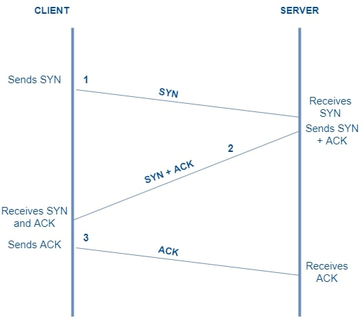

# Protocols TCP & UDP

The **TCP** (Transmission Control Protocol) and **UDP** (User Datagram Protocol) are two of the most common network protocols used for transferring data over computer networks

The **TCP** protocol is a connection-oriented protocol that provides reliable data delivery, while the **UDP** protocol is a connectionless protocol that does not guarantee data delivery

In other words, in the **TCP (Transmission Control Protocol)**. Its top priority is reliability. It doesn't mind taking a little longer, but it ensures that every piece of data reaches its destination intact and in the correct order

On the other hand, there's **UDP (User Datagram Protocol)**. Its top priority is speed. UDP doesn't care if anything gets lost along the way; its job is to send the information as quickly as possible

# Common TCP Ports

21: **FTP (File Transfer Protocol)** - allows files to be transferred between systems.

22: **SSH (Secure Shell)** - a secure network protocol that allows users to connect to and manage systems remotely.

23: **Telnet** - a protocol used for remote connection to network devices.

80: **HTTP (Hypertext Transfer Protocol)** — the protocol used for data transfer on the World Wide Web.

443: **HTTPS (Hypertext Transfer Protocol Secure)** — the secure version of HTTP, which uses SSL/TLS encryption to protect web communications.

# Common UDP Ports:

53: **DNS (Domain Name System)** — a system that translates domain names into IP addresses.
    
67/68: **DHCP (Dynamic Host Configuration Protocol)** — a protocol used to assign IP addresses and other configuration parameters to devices on a network.
    
69: **TFTP (Trivial File Transfer Protocol)** — a simple protocol used to transfer files between devices on a network.
    
123: **NTP (Network Time Protocol)** — a protocol used to synchronize the clocks of devices on a network.
    
161: **SNMP (Simple Network Management Protocol)** — a protocol used to manage and monitor devices on a network.

It should be noted that these are just some of the most common ones. There are many more ports that operate over both **TCP** and **UDP**

# Three-Way Handshake

The Three-Way Handshake is a procedure used to establish a connection between two devices. This procedure consists of three steps: **SYN**, **SYN-ACK**, and **ACK**, during which the sequence and acknowledgment numbers of the packets are synchronized between the devices. The Three-Way Handshake is essential for establishing a reliable and secure connection over **TCP**

# The 3 Handshake Packets in Detail

For TCP to work, packets don't just carry text, they carry "**flags**" which are like on/off switches and “**sequence numbers**” to keep track of the order

**STEP 1** The Client initiates the connection **(SYN)**

The client (for example, your web browser) wants to talk to the server. To do this, it generates a random initial sequence number (let's call it $Seq = X$) and sends a packet with the SYN flag active (1)

**STEP 2** The Server responds and proposes **(SYN-ACK)**

The server receives the packet. If it has the port open and is willing to talk, it must do two things: confirm that it received the client's message and propose its own sequence number.
To do this, it sends a packet with two active flags: SYN (1) and ACK (1)

**The ACK (Acknowledgment):** It takes the client's number ($X$), adds 1 ($X + 1$), and places it in the Acknowledgment Number field

**The SYN (Synchronization):** The server generates its own independent initial random number (let's call it $Seq = Y$)

**Server State:** Changes to SYN-RECEIVED

**STEP 3** The Client confirms the agreement **(ACK)** 

The client receives the SYN-ACK from the server. Now the client knows that the server hears it well. The last step is to confirm that it also hears the server well.
It sends a final packet with the ACK flag active (1)

**How are the numbers formed?** The client's sequence number is now $Seq = X + 1$. The acknowledgment number is the server's number plus one ($Ack = Y + 1$), which means: "I received your $Y$, I expect the next thing to be $Y+1$".State of both: The connection becomes officially ESTABLISHED

# Real Numerical Example

Let's imagine that the initial random numbers assigned by the operating system are simple numbers to understand the protocol's math:

SYN (Client $\rightarrow$ Server): * $Seq = 1000$ | $Ack = 0$ | Flag: SYN

SYN-ACK (Server $\rightarrow$ Client): * $Seq = 5000$ | $Ack = 1001$ ($1000 + 1$) | Flags: SYN, ACK

ACK (Client $\rightarrow$ Server): * $Seq = 1001$ | $Ack = 5001$ ($5000 + 1$) | Flag: ACK

From this moment on, if the client wants to send a 100-byte message, the server will know perfectly well that those bytes correspond to the block starting at number $1001$.
